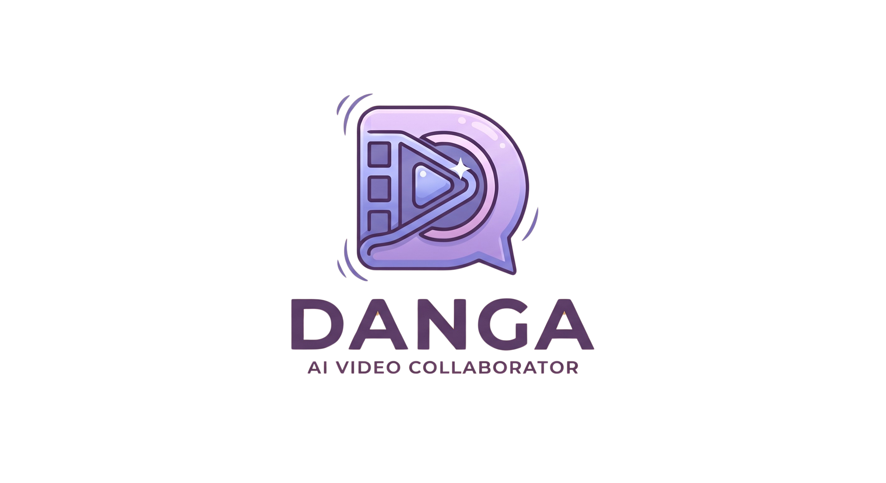

<p align="center">
  
</p>

<h1 align="center">Danga</h1>
<p align="center"><strong>AI Video Collaborator for Short-Form Creators</strong></p>

<p align="center">
  Describe what you want. Danga edits it.
</p>

<p align="center">
  
  
  
  
  
</p>

---

## What is Danga?

Danga is a web-first AI video editing tool built for short-form content creators — especially Nigerian and African creators. Instead of dragging clips around a timeline, you chat with Danga in plain language and it assembles your footage into a ready-to-post video.

It remembers your saved clips, your caption style, your usual music taste, and your editing preferences across sessions — so it gets more "you" the more you use it.

---

## Key Features

- **Chat-driven editing** — describe what you want in plain language, Danga builds the edit plan and renders it
- **Persistent memory** — saved asset library and style profile that carry over across sessions
- **Plan before render** — see and approve exactly what Danga will do before a single credit is spent
- **Review and refine** — iterate in chat after each render, revert to any version, keep all history
- **Export anywhere** — download the finished video, an SRT caption file, and the raw component clips for further editing in CapCut, Premiere, or any other tool
- **Notes** — auto-logged record of what was done, what wasn't, and how to achieve unsupported edits elsewhere
- **Local-first** — built with Nigerian creators in mind: Pidgin-aware captioning, Afrobeats-friendly defaults, local payment via Paystack

---

## Tech Stack

| Layer | Choice |
|---|---|
| Framework | Next.js (App Router) |
| Language | TypeScript (strict) |
| Styling | Tailwind CSS |
| Database + Auth + Storage | Supabase |
| AI (development) | Google Gemini Flash |
| AI (production) | Anthropic Claude (claude-sonnet-4-6) |
| Render API | Creatomate |
| Payments | Paystack (NGN) + Stripe (USD) |
| Hosting | Vercel |

---

## Getting Started

### Prerequisites

- Node.js 18+
- A [Supabase](https://supabase.com) account and project
- A [Creatomate](https://creatomate.com) account and API key
- A [Google AI Studio](https://aistudio.google.com) API key (free, no credit card)

### Installation

```bash
git clone https://github.com/yourusername/danga.git
cd danga
npm install
```

### Environment Variables

Create a `.env.local` file in the root of the project:

```env
# AI — set to gemini for development, switch to claude for production
AI_PROVIDER=gemini
GEMINI_API_KEY=
ANTHROPIC_API_KEY=

# Render API
CREATOMATE_API_KEY=
CREATOMATE_WEBHOOK_SECRET=

# Supabase
NEXT_PUBLIC_SUPABASE_URL=
NEXT_PUBLIC_SUPABASE_ANON_KEY=
SUPABASE_SERVICE_ROLE_KEY=

# Payments
NEXT_PUBLIC_PAYSTACK_PUBLIC_KEY=
PAYSTACK_SECRET_KEY=
STRIPE_PUBLISHABLE_KEY=
STRIPE_SECRET_KEY=
STRIPE_WEBHOOK_SECRET=

# App
NEXT_PUBLIC_APP_URL=http://localhost:3000
```

### Database Setup

Run the migration SQL against your Supabase project:

```bash
# Via Supabase CLI
supabase db push

# Or paste /supabase/migrations/001_init.sql directly into the Supabase SQL editor
```

### Run Locally

```bash
npm run dev
```

Open [http://localhost:3000](http://localhost:3000).

---

## Project Structure

```
/app
  /api               — Route handlers (chat, render, webhook, upload, usage, payments)
  /(auth)            — Login and signup pages
  /(app)             — Protected app pages
    /onboarding      — First-time style setup (skippable)
    /dashboard       — Asset library and style profile
    /projects/[id]   — Chat, plan, render, and review screen
    /export/[id]     — Export finished version
/components
  /ui                — Shared UI components
  /chat              — Chat interface components
  /library           — Asset grid and style profile components
  /review            — Video player and version history
  /export            — Export screen components
/lib
  /ai.ts             — AI provider abstraction (Gemini ↔ Claude, one-line swap)
  /creatomate        — Render API translator and submission logic
  /supabase          — Supabase browser and server clients
  /usage             — Usage tracking and cap enforcement
  /plans.ts          — Plan limits config (renders, messages, storage per tier)
/supabase
  /migrations        — Database migration SQL
/public
  /logo.png          — App logo
  /favicon.ico       — Browser tab icon
  /og-image.png      — Social share preview image
```

---

## Pricing

| Plan | Price | Renders/month | Storage | Resolution |
|---|---|---|---|---|
| Free | $0 | 5 | 2GB | 720p |
| Creator | $10/month | 25 | 10GB | 1080p |
| Pro | $30/month | 90 | 50GB | up to 4K |

Payments accepted in USD (Stripe) and NGN (Paystack).

---

## Switching AI Providers

During development the app runs on Google Gemini Flash (free). To switch to Claude for production, update two environment variables — no code changes needed:

```env
AI_PROVIDER=claude
ANTHROPIC_API_KEY=sk-ant-...
```

All AI calls go through `/lib/ai.ts` only, keeping the provider swap isolated.

---

## Roadmap

### V1 — Current
- [x] Chat-driven editing with plan-before-render
- [x] Personal asset library with persistent style profile
- [x] Version history with pin, revert, and auto-expiry
- [x] Export: video, SRT captions, raw components
- [x] Notes with auto-logged unachievable tasks
- [x] Free / Creator / Pro tiers with Paystack + Stripe

### V2 — Planned
- [ ] AI-generated visual content (image and video generation)
- [ ] Automatic spoken-audio captioning with Nigerian Pidgin support
- [ ] Deeper third-party integrations
- [ ] Architecture upgrades for scale

---

## Contributing

This is a solo project currently in active development. Contributions, issues, and feature suggestions are welcome once the v1 milestone is reached.

---

## License

MIT

---

<p align="center">Built in Lagos 🇳🇬</p>
